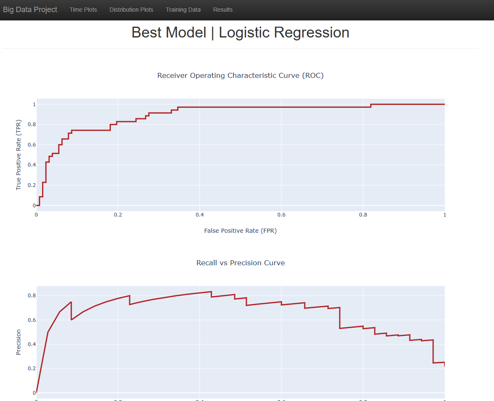

# Sparkify

by: Ahmed A. Youssef

## Data Source

The data was provided by Udacity in a JSON format. The sample dataset was `128 MB`. The full dataset size was `12 GB`. The Sparkify dataset contains the following data:
```
 - artist - string (nullable = true): artist name.
 - auth - string (nullable = true): authentication method user by the user.
 - firstName - string (nullable = true): user's first name.
 - lastName - string (nullable = true): user's last name.
 - gender - string (nullable = true): user's gender.
 - itemInSession - long (nullable = true): item id selected by the user in this session.
 - length - double (nullable = true): length of current session in epoch time.
 - level - string (nullable = true): subscribtion level (paid or free).
 - location - string (nullable = true): city and state
 - method - string (nullable = true): PUT, GET, SET requests used by the user.
 - page - string (nullable = true): current page selected by the user.
 - registration - long (nullable = true): registration date of the user for the Sparkify service.
 - sessionId - long (nullable = true): current session id.
 - song - string (nullable = true): song name.
 - status - long (nullable = true): request status 200, 404..etc.
 - ts - long (nullable = true): time since registration in epoch time
 - userAgent - string (nullable = true): web browser used by the user in current session.
 - userId - string (nullable = true): unique Id of the user.
```

## Libraries Dependency
- re
- plotly
- datetime
- pandas
- Pyspark
- flask

## Project Motivation

This project focuses on analyzing big data using Pyspark. The final product is a web application for churn classification. Customers are classified into two churn groups; churned or not.

### EDA Analysis observations:

After performing EDA analysis, these are the main observations:
 
- The top columns with missing records are artist, length of song and song name. The first name, gender, last name, location, registration and user agent have the same number of missing records.
- Based on this sample data, most users are registred and have an account on the website. Less than `3 %` of these users logout of their Sparkify app.
- Most users are subscribed from California state. New York and Texas share a similar user base size. 
- As expected, most users interact more with Next song page, `79 %` of all recorded actions. Cancellation and downgrade requests are less than other customer groups in this log. This suggests imbalanced data when trying to classify customers into churn groups (churned or not).
- We have a similar distribution of customers based on their gender.
- There was a spike in the number of new customers Sparkify had in `October 2018 (164,834 customers)`. The trend observed here may suggest an increase in the number of new customers in the period between `June and October (summer time)`.
- The activity on Sparkify increases from `12:00 am to reach its max by 9:00 am`. From `9:00 am to 13:00 pm`, there is a small drop in the number of active users. After `13:00 pm`, The number of active users drops significantly till `11:00 pm`.
- Number of users submitted cancellation requests is `52` out of `226` customers. The churn rate is `23.01 %`.
- The histogram for the number of thumps up users submit is highly skewed to the right.
- The histogram for the number of thumps down users submit is highly skewed to the right but at much lower rates than thumps up. Check the range of both histograms.
- The histogram the number of played songs is highly skewed to the right. Most users listen to `500 to 1000` songs on average during their subscription. 
- The histogram for  the number of days user stayed loyal to Spakify is highly skewed to the left. Most users stayed loyal for a period betweeb `50 to 60 days` on average during their subscription to Sparkify. 
- There is a strong negative correlation `(-0.49)` between the number of days users stay subscribed to Sparkify, and the number of songs users listen to per hour
- There is a positive correlation `(0.44)` between the number of days users remain subscribed to Sparkify, and the number of songs users listen to.


### Feature Engineering

After exploring the sample DataFrame, I created a new DataFrame called `df_features` which contains re-engineered features for the ML modeling.  The new DataFrame `df_features` contains the following features:

```
- userId: unique Id for each user.
- Churned: whether the user is still a customer or not. If the user is still a customer then Churned is False. If not, then True.
- SongsPlayed: the number of Songs played by a user.
- ThumbsUp: the number of times the user voted a song up.
- ThumbsUp: the number of times the user voted a song down.
- Days: the number of days since the user started using Sparkify.
- upPerSong: the ratio of songs voted up by a user.
- downPerSong: the ratio of songs voted down by a user.
- songsPerHour: the ratio between the total number of songs and the played hours since the user subscribed to Sparkify.
```

### ML Modeling

I divided the full dataset into train, test, and validation sets. I evaluated the accuracy of logsitic regression and performed hyper-parameters tuning as necessary. Since the churned users are a fairly small subset, I used F1 score as the metric to optimize.

- Logicistic regression was used as a starting point for the ML modeling. It's a good candidate for binary classification problems.
    - For training data, AUC was `0.89`.
    - For training data, the best cutoff value is `0.38` and the best F-score is `0.72`.
    - For the validation dataset, The accuracy was `0.89`.
    - For the testing dataset, the accuracy was `0.81` and AUC was `0.89`

- When fine tuning the hyper-parameters:
    - For validation dataset, The accuracy was `0.89` and AUC was `0.92`.
    - For test dataset, accuracy was `0.84` and AUC was `0.93`.
    
The fine tuned logistic regression model performed slightly better than the default model.

## Project Files

- ```Sparkify.ipynb```: contains all the workflow steps; EDA analysis, ETL steps and ML modeling.
- ```app\run.py```: module to deploy and run the flask app into a local server.
- ```app\templates\master.html```: display the main page of the web app. 
- ```app\templates\timeplot.html```: display timeline plots page.
- ```app\templates\distplot.html```: display distribution plots for numerical features.
- ```app\templates\traindata.html```: display training data plots after transformation.
- ```app\templates\results.html```: display the results of the best ML model (Logistic regression). 

## Web Application Workflow

### Instructions:

- Run the following command in the app's directory to deploy and fire a local web app using flask server.
```
    - python run.py
    - Go to http://localhost:3001/
```

### Results

After firing the web app, you should be able to see a the main page shown below. It will show a sample view of the original dataset along with four bar plots for the categorical features.


The second page `/timeplot` is the timeplot page. This page has two timeplots on; the number of new customers Sparkify enjoys each month and the number of active users each hour.


The third page `/distplot` is the distribution page which contains four histrograms for the numerical features.


The fourth page `/traindata` has one table showing a sample of the clean and transformed dataset beside a heat map to show correlation between numerical features.


The fifth page `/results` has three plots to demonstrate the results of the best ML model.


